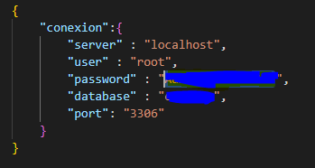
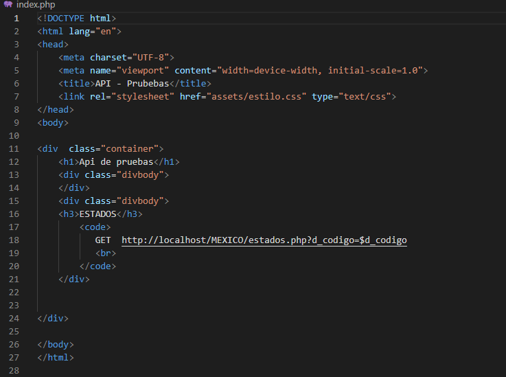
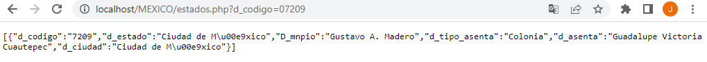
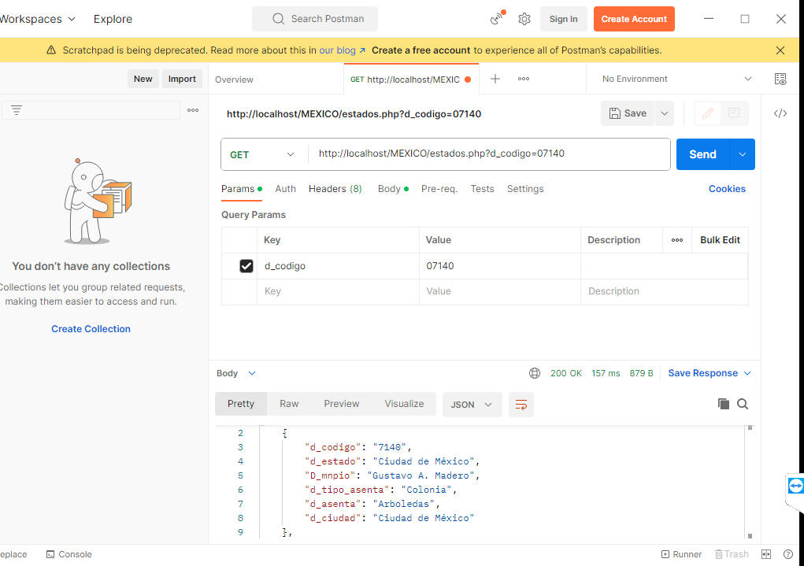
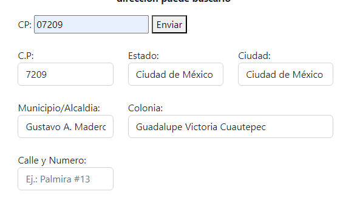
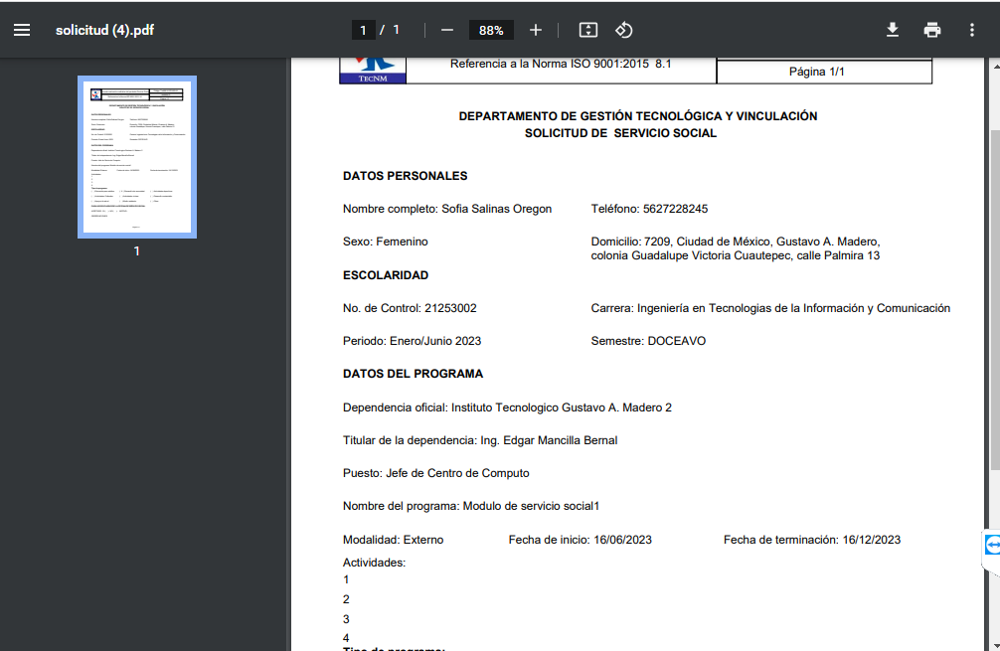

# ESTADO_MEXICO
API que permite por medio del codigo postal 
obtener las direcciones en México asociadas a dicho codigo, 
este proyecto fue desarrollado con php realizando
consultas a una base de datos MySQL, este proyecto se desarrollo e implemento
con el objetivo de poder hacer consultas de direcciones en mi proyecto
de Servicio Social el cual se encuentra en el siguiente repositorio.
https://github.com/Joakiiin/portafolio

# CARACTERISTICAS
- Consulta de direcciones base al codigo postal;
- Consumible desde PHP;
- Base de datos obtenida directamente de la pagina de correos de México;

# INSTALACION E IMPLEMENTACION
- Descargar la carpeta del proyecto e implementarla ya sea en tu localhost;
- Importar la base de datos en tu gestor de base de datos, la base de datos es algo pesada, recomiendo configurar para aumentar el tiempo de espera para que no te mate el proceso a medias, otra opcion que fue lo que yo hice fue descargar el archivo xlx desde la web de correos de mexico e importar tabla por tabla, es mas tardado pero sabes perfectamente lo que tienes;
- Modificar tu archivo config con las credenciales y el nombre de tu base de datos;
  


- Modifica el URL por el cual va a ser consumida la api segun donde tu tengas almacenado el proyecto, por ejemplo mi link es el siguiente;



# PRUEBA DE FUNCIONAMIENTO
## METODO 1
- El metodo 1 es la forma mas sencilla de probar el correcto funcionamiento de la API, ustedes simplemente deberan copiar la url de su proyecto junto a los parametros que utilizaran, dicha información la encontraran en el index.php del proyecto, sustituyen el $d_codigo al final de la url por un codigo postal de México y el correcto funcionamiento debe lucir igual que en la imagen inferior.



## METODO 2
- El metodo 1 aunque mas facil y rapido podran notar no es algo muy elegante a falta de codificación UTF-8 por parte de un html, utilizando el software de Postman obtendras unos resultados mas adecuados, dicho software lo puedes descargar e instalar desde la siguiente liga: https://www.postman.com/downloads/
- Una vez descargado e instalado al igual que el metodo 1 copiaran la url sustituyendo $_codigo por un codigo postal de México, le indican al software que el metodo a utilizar es GET y dan click en SEND, podran apreciar en la imagen inferior los resultados de un correcto funcionamiento.



# CASO DE USO EN CODIGO
- Primero que nada genere un archivo llamado datos_estado.php en mi proyecto, dicho archivo contiene el link de la api la cual recibira el parametro del codigo postal por metodo GET.
```
<?php

if (isset($_GET['d_codigo'])) {
  $d_codigo = $_GET['d_codigo'];
  $datos = json_decode(file_get_contents("http://localhost/MEXICO/estados.php?d_codigo=$d_codigo"), true);
  if ($datos) {
    // Si se encontraron datos para el alumno, devolverlos en formato JSON
    echo json_encode($datos);
  } else {
    // Si no se encontraron datos para el alumno, devolver un mensaje de error en formato JSON
    echo json_encode(['error' => "No se encontraron datos para el paciente con ID $d_codigo"]);
  }
}
?>
```

- En mi caso muy especifico yo queria utilizar mi API de manera tal que el alumno pudiera llenar la mayoria de sus datos de dirección unicamente con el codigo postal sin que se recargara la pagina, al haber mas de una colonia asociada a un codigo me vi en la necesidad de utilizar JS para poder desplegar los datos.

```
<script>
function obtenerDatos(event) {
  event.preventDefault(); // Evita que el formulario se envíe de forma tradicional
  const d_codigo = document.getElementById("d_codigo").value;
  fetch(`procesos/alumno/crud/datos_estado.php?d_codigo=${d_codigo}`)
    .then(response => response.json())
    .then(data => {
      if (data.error) {
        alert(data.error); // Muestra un mensaje de error si no se encontraron datos
      } else {
        console.log(data);
        document.getElementById("estado").value = data[0].d_estado; // Actualiza el campo de estado con los datos del estado
        document.getElementById("cp").value = data[0].d_codigo; // Actualiza el campo de cp con los datos del estado
        document.getElementById("municipio").value = data[0].D_mnpio;
        //Ciudades
        const ciudadSelect = document.getElementById("ciudad");
        ciudadSelect.innerHTML = ""; // Borra todas las opciones previas del menú desplegable
        for (let i = 0; i < data.length; i++) {
          const ciudad = data[i].d_ciudad;
          const option = document.createElement("option");
          option.text = ciudad;
          ciudadSelect.add(option); // Agrega la opción al menú desplegable
        }
        //Colonias
        const coloniaSelect = document.getElementById("colonia");
        coloniaSelect.innerHTML = ""; // Borra todas las opciones previas del menú desplegable
        for (let i = 0; i < data.length; i++) {
          const colonia = data[i].d_asenta;
          const option = document.createElement("option");
          option.text = colonia;
          coloniaSelect.add(option); // Agrega la opción al menú desplegable
        }
      }
    })
    .catch(error => console.error(error));
}
</script>
```

- Por ultimo agregue dos formularios, uno con Metodo Get y otro con metodo POST, el get enviara la información mediante js al archivo datos_estado.php el cual devolvera al form que utilizara metodo POST la información del codigo postal que posteriormente sera enviada al documento tecnm01.php.

```
<form method="get" action="procesos/alumno/crud/datos_estado.php" onsubmit="obtenerDatos(event)">
                        <label for="d_codigo">CP:</label>
                        <input type="text" id="d_codigo" name="d_codigo" value="<?php echo isset($_GET['d_codigo']) ? $_GET['d_codigo'] : ''; ?>">
                        <button type="submit">Enviar</button>
                        </form>
                        <br>
                        <form id="frmSolicitud" action="formatos/tecnm01.php" target="_blank" method="post" onsubmit="return agregarFechasAlumno()"  enctype="multipart/form-data">
                        <div class="form-gruop">
                            <div class="row">
                                <div class="col-md-4">
                                    <label for="cp">C.P:</label>
                                    <input type="text" name="cp" class="form-control" id="cp" placeholder="Ej.: 07209">
                                </div>
                                <div class="col-md-4">
                                    <label for="estado">Estado:</label>
                                    <input type="text" name="estado" class="form-control" id="estado" placeholder="Ej.: Ciudad de Mèxico">
                                </div>
                                <div class="col-md-4">
                                    <label for="ciudad">Ciudad:</label>
                                    <select name="ciudad" class="form-control" id="ciudad"></select>
                                    <br>
                                </div>
                                <div class="col-md-4">
                                    <label for="municipio">Municipio/Alcaldia:</label>
                                    <input type="text" name="municipio" class="form-control" id="municipio" required placeholder="Ej.: Gustavo A. Madero"></select>
                                    <br>
                                </div>
                                <div class="col-md-8">
                                    <label for="colonia">Colonia:</label>
                                    <select name="colonia" class="form-control" id="colonia" required placeholder="Ej.: Guadalipe Victoria"></select>
                                    <br>
                                </div>
                                <div class="col-md-4">
                                    <label for="calle">Calle y Numero:</label>
                                    <input type="text" name="calle" class="form-control" id="calle" required placeholder="Ej.: Palmira #13">
                                    <br>
                                </div>
```

# Resultados
- Podemos apreciar que implementando las lineas de codigo anteriores nos da el siguiente resultado en el formulario.

  

  

  - Podemos apreciar es una manera sencilla de utilizarlo, indudablemente existen otras maneras pero fue lo que me dio resultado para mi necesidad en especifico, ustedes pueden modificar parametros para obtener mas o menos información segun lo que se requiera.
